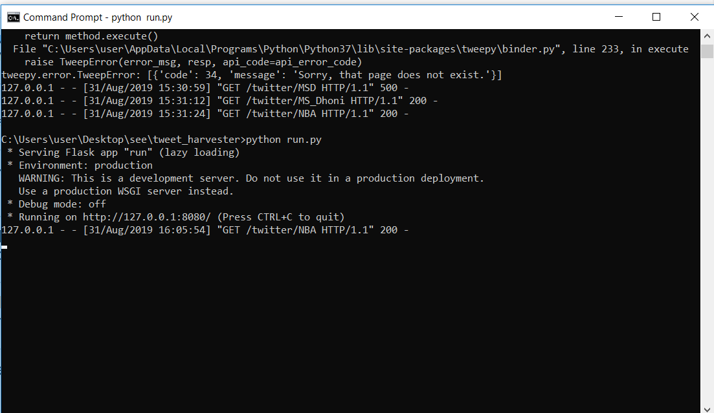
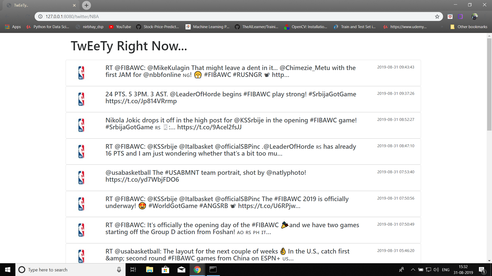

# Tweety_WebAPP
* Displays the Tweets on demand.

## How it Works!

`Run the file run.py`
`go to localhost @ 127.0.0.1:8080`

`After entering into localhost expand the URL with 127.0.0.1:8080/twitter/<twitter_username>`

#### `For example`

### Accessing Twitter Api:

* Create twitter Acount and head on to twitter Developer with link:[1]:https://app.twitter.com and create a new app after sign in.
* You now should be able to access all the required API Keys and authorization credentials.

You should be able to find everything under the “Keys and Access Tokens” Tab for all the Twitter API Key details.
